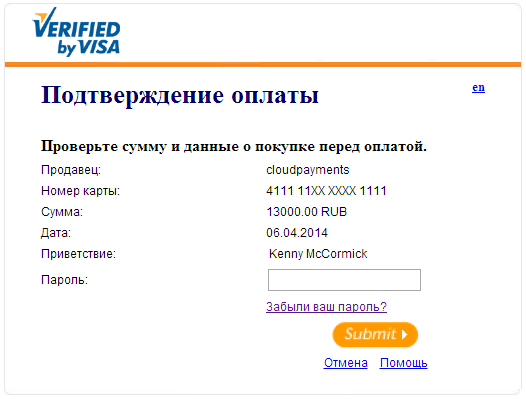

#  Общая информация

Версия 2.1 от 27.09.2017

## Термины и определения

* **Система** — платежный шлюз CloudPayments.  
* **ТСП** — торгово-сервисное предприятие, работающее с системой.  
* **API** — программный интерфейс для взаимодействия с системой, расположенный по адресу https://api.cloudpayments.ru  
* **ЛК** — личный кабинет ТСП в системе, расположенный по адресу https://merchant.cloudpayments.ru  
* **Карта** — банковская карта платежных систем Visa, MasterCard или МИР.  
* **Эквайер** — расчетный банк.  
* **Эмитент** — банк, выпустивший карту.  
* **Держатель** — физическое лицо, которому эмитент выдал карту в пользование.  
* **Виджет** — платежная форма, предоставленная системой для ввода реквизитов карты держателем и последующей авторизации.  
* **3-D Secure** — протокол проверки держателя эмитентом.  

## Виды операций

Система предполагает два вида операций: оплата и возврат. В первом случае деньги перечисляются со счета держателя в пользу ТСП, во втором — наоборот. Возврат выполняет ТСП в случае желания покупателя вернуть товар, и он всегда связан с операцией оплаты, сумма средств с которой будет возвращена держателю. Возвращать можно как всю сумму оплаты, так и ее часть. Деньги обычно возвращаются на карту держателя в тот же день, но иногда (зависит от эмитента) могут идти до 3-х дней.
Операцию оплаты, в отличие от возврата, можно отменить. Отмену оплаты выполняет ТСП в случае, если платеж был совершен с ошибкой: неверная сумма, технический сбой и т.д. Есть ограничение — отменить операцию можно только в случае использования двустадийной схемы оплаты. Деньги при этом будут разблокированы на карте держателя практически мгновенно.

## Схемы проведения платежа
Существуют два варианта проведения операции оплаты: одно- и двухстадийная, их также называют *single message scheme* (SMS) и *dual message scheme* (DMS).  
 
**Одностадийная** оплата выполняется одной командой, по результатам которой проходит авторизация и последующее списание средств в пользу ТСП.  
 
**Двухстадийная** оплата подразумевает использование двух команд: отдельно на авторизацию, отдельно на списание. После успешной авторизации, сумма операции будет блокирована на счету держателя, то есть он не сможет ей воспользоваться. Далее у ТСП есть до 7 дней в зависимости от типа карты для подтверждения операции, после чего произойдет списание денег. Если операцию не подтвердить в течение этого времени — она будет автоматически отменена. Подтверждать можно как всю сумму авторизации, так и часть.  
Как правило, двухстадийная схема используется для получения депозита с плательщика, например, в прокатных компаниях или отелях.

В зависимости от настройки, система может автоматически выполнять подтверждение двустадийных платежей через указанное количество дней.

## Способы оплаты

Оплату можно проводить следующими способами:

* Через платежную форму — [виджет](#platezhnyy-vidzhet).
	На вашем сайте прописывается скрипт, который открывает защищенную платежную форму (iframe) для ввода карточных данных.

* Через [API](#api) по криптограмме карты.
    На вашем сайте прописывается скрипт [checkout](#skript-checkout), который собирает карточные данные из любой формы на сайте, шифрует и создает криптограмму для безопасной передачи через межсерверное взаимодействие.

* Через SDK для мобильных приложений.
    Интегрируйте мобильное [SDK](#sdk-dlya-mobilnyh-prilozheniy) в ваше приложение для [iOS](#sdk-dlya-ios) или [Android](#sdk-dlya-android) и принимайте карты к оплате с телефона или планшета ваших покупателей.

* Через [Apple Pay](#apple-pay) и [Google Pay](#google-pay) на сайтах и в мобильных приложениях.

* Через [API](#api) по токену карты (рекарринг).
    После первой оплаты через виджет или криптограмму, система присваивает карточным данным идентификатор — токен, который можно безопасно хранить и использовать для безакцептных платежей (pay per click). Токен возвращается в [Pay](#pay) уведомлении и в ответе системы на запрос по API.

* С помощью настроенного плана периодических платежей (рекуррент).
   После первой оплаты или авторизации на 1 рубль для проверки карты, система присваивает карточным данным токен, который далее используется для [создания плана подписки](#sozdanie-podpiski-na-rekurrentnye-platezhi)
) на рекуррентные платежи. Оплата производится системой автоматически, без подтверждения плательщика, в соответствии с настроенным периодом, который может быть один раз в день (один раз в несколько дней), один раз в неделю (один раз в несколько недель) или один раз в месяц (один раз в несколько месяцев). Если очередная попытка оплаты не удалась, система отправляет уведомление и повторяет попытку через сутки. После трех неудачных попыток подряд, система отменяет подписку.  
   При создании плана можно указать максимальное количество периодов, например, 12 месяцев при ежемесячной оплате, после чего подписка будет автоматически завершена. 

## 3-D Secure

3-D Secure — общее название программ Verified By Visa и MasterCard Secure Code от платежных систем Visa и MasterCard соответственно. Суть программы в проверке подлинности держателя (то есть защита от несанкционированного использования карты) эмитентом перед оплатой. На практике это выглядит так: держатель указывает реквизиты карты, далее открывается сайт эмитента, где держателю предлагается ввести пароль или секретный код (как правило, код отправляется в СМС сообщении). Если код указан правильно, оплата будет проведена. Если нет — отклонена.  

3-D Secure в процессе оплаты появляется не на всех картах, а только тех, банки-эмитенты которых поддерживают данную технологию. Проведение оплаты без 3-D Secure безусловно является существенно менее безопасным вариантом.

